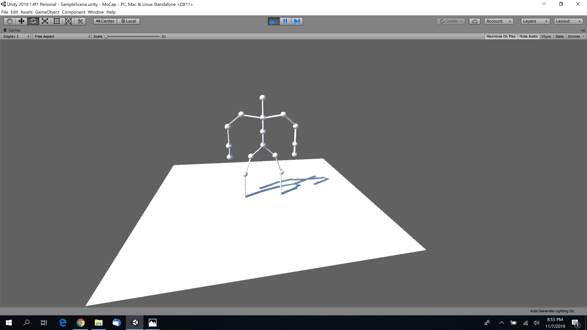

# Assignment 3 -mocap

## Goal

Writing a **BVH motion viewer**

- Simulate walking of a very simple two legged skeleton using keyframing.
- Read, interpret and apply motion capture data.

## Motion capture data formats
No “standard” moCap data format
- Defacto standards from motion capture system manufacturers
- Must specify both structure of skeleton as well as sampled data for each joint.
- http://en.wikipedia.org/wiki/List_of_motion_and_gesture_file_formats
- Info about the heirarchy will be found in the BVH file.
	- Sample bvh files on mycourses as well as ASSIGNMENTS section of course Web site.
	- More samples at bvhfiles.com (free registration required)

## Figure Model

Use simple geometry to model bones
>¤Cylinders
¤Boxes
¤Lines
¤Spheres at joints (optional)
¤Include a simple floor as a point of reference. Estimate placement by position of foot.

## Setting up an articulated figure
For each bone, you must maintain:
- Position of joint (with respect to the center to the parent).
	- This remains constant in time
- Rotation at this joint
	- With respect to the parent
	- This will vary in time
- Time varying positional data is only provided for the root node.

## Animating an articulated figure

Assuming we have determined values for  
> all DOF for a given time step, t.
	
	orient_bone(bone)
		get parent rotation
		get parent translation 
		
	apply bone offset to translation
	apply rotation(s) at joint
	
	for each child c of the bone
		orient_bone ( c );

## Bells and Whistles

- 15 points
	- Basic read / playback of data
- Extras
	- 5 points
		- Interactive control of "time"/ playback
	- 5 points
		- Include ability to speed up / slow down motion
		- Change sampling rate
		- No filtering required

## Notes
Try several BVH files
- Grading will be done only a variety of samples.
- I.e. Don't hardcode hierarchy
- Tips on reading and interpreting **BVH** files:
				- http://www.cs.wisc.edu/graphics/Courses/cs-838-1999/Jeff/BVH.html 

## Screenshot
Status: Work In Progress
